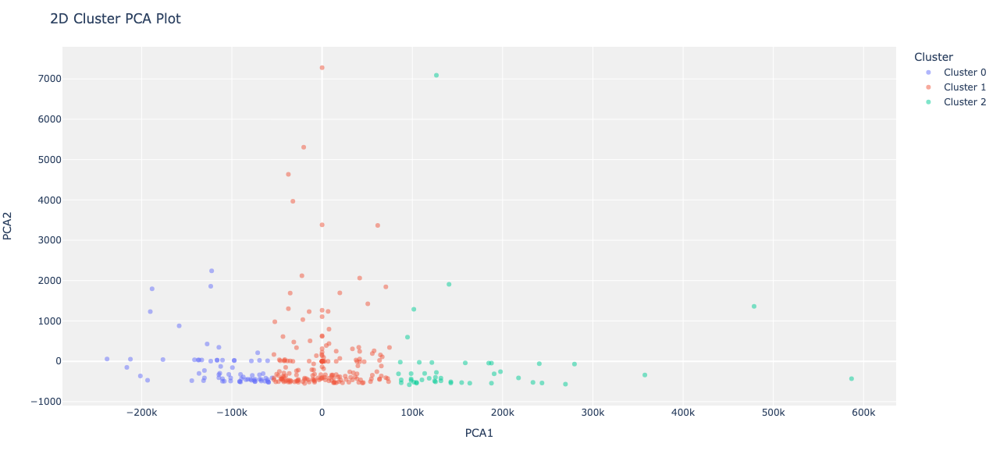
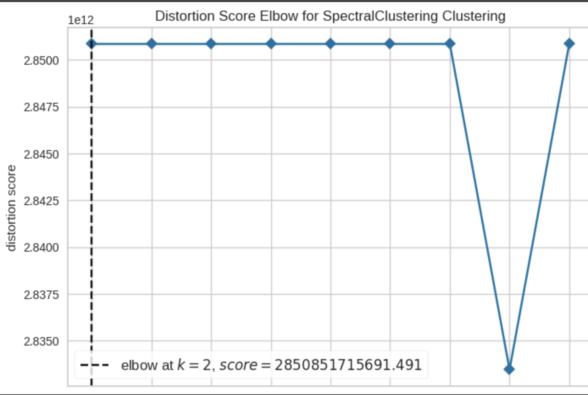

# Clustering Analysis on Heart Failure Clinical Records

This project is a comprehensive study on clustering analysis applied to the Heart Failure Clinical Records dataset from the UCI Machine Learning Repository. Using the PyCaret library, we explore various clustering algorithms to uncover inherent groupings within the data.

## Dataset

The dataset for this analysis is the Heart Failure Clinical Records dataset, which can be accessed [here](https://archive.ics.uci.edu/ml/datasets/Heart+failure+clinical+records). It consists of multiple features related to heart disease conditions in patients, which are used to predict mortality by heart failure.

## PyCaret: An Automated Machine Learning Library

[PyCaret](https://pycaret.org/) is an open-source, low-code machine learning library in Python that automates machine learning workflows. It is an end-to-end machine learning and model management tool that speeds up the experiment cycle exponentially.

## Clustering Algorithms

In this study, we employ several clustering algorithms to evaluate their performance on the dataset:

### K-Means Clustering

K-Means clustering is a method of vector quantization that aims to partition 'n' observations into 'k' clusters in which each observation belongs to the cluster with the nearest mean.

#### 2D PCA GRAPH-

#### 3D GRAPH-

#### ELBOW GRAPH-

### Hierarchical/Agglomerative Clustering

Agglomerative clustering is a type of hierarchical clustering that builds nested clusters by merging or splitting them successively. This hierarchy of clusters is represented as a tree (or dendrogram).

!#### 2D PCA GRAPH-

#### 3D GRAPH-

#### ELBOW GRAPH-

### Affinity Propagation

Affinity propagation creates clusters by sending messages between pairs of samples until convergence. Unlike K-Means, it does not require the number of clusters to be determined or estimated before running the algorithm.

!#### 2D PCA GRAPH-

#### 3D GRAPH-

#### ELBOW GRAPH-

### Spectral Clustering

Spectral clustering uses the spectrum (eigenvalues) of the similarity matrix of the data to perform dimensionality reduction before clustering in fewer dimensions.

!#### 2D PCA GRAPH-

#### 3D GRAPH-

#### ELBOW GRAPH-

## Comparative Study

We compare the performance of the above algorithms using various pre-processing techniques and different numbers of clusters. The evaluation is based on parameters such as the Silhouette Score, Calinski-Harabasz Index, and Davies-Bouldin Index.

### Sample Result Table

## Performance using different clustering techniques on various parameters

### Using K-Mean Clustering

## Performance using K-Mean Clustering on various parameters

|                    | No Data Processing       |                      |                      | Using Normalization  |                      |                      | Using Transformation |                      |                      | Using PCA             |                      |                      | Using T+N             |                      |                      | Using TNP             |                      |                      |
|--------------------|--------------------------|----------------------|----------------------|----------------------|----------------------|----------------------|----------------------|----------------------|----------------------|----------------------|----------------------|----------------------|----------------------|----------------------|----------------------|----------------------|----------------------|----------------------|
| Parameters         | c=3                      | c=4                  | c=5                  | c=3                  | c=4                  | c=5                  | c=3                  | c=4                  | c=5                  | c=3                  | c=4                  | c=5                  | c=3                  | c=4                  | c=5                  | c=3                  | c=4                  | c=5                  |
| Silhouette         | 0.1119                   | 0.1091               | 0.1050               | 0.5481               | 0.5550               | 0.5384               | 0.1019               | 0.1004               | 0.0934               | 0.5481               | 0.5550               | 0.5384               | 0.1019               | 0.1004               | 0.0934               | 0.1002               | 0.0995               | 0.0901               |
| Calinski-Harabasz  | 30.5711                   | 27.1911               | 26.8564               | 390.9995              | 499.2357              | 602.3528              | 31.2372               | 28.7375               | 25.2785               | 390.9995              | 499.2357              | 602.3528              | 31.2372               | 28.7375               | 25.2785               | 30.9257               | 28.7118               | 24.6674               |
| Davies-Bouldin     | 2.7694                    | 2.3423                | 2.1512                | 0.5652                | 0.5645                | 0.5070                | 2.6056                | 2.4102                | 2.4469                | 0.5652                | 0.5645                | 0.5070                | 2.6056                | 2.4102                | 2.4469                | 2.6741                | 2.4223                | 2.4010                |

### Using Hierarchical Clustering

|                    | No Data Processing       |                      |                      | Using Normalization  |                      |                      | Using Transformation |                      |                      | Using PCA             |                      |                      | Using T+N             |                      |                      | Using TNP             |                      |                      |
|--------------------|--------------------------|----------------------|----------------------|----------------------|----------------------|----------------------|----------------------|----------------------|----------------------|----------------------|----------------------|----------------------|----------------------|----------------------|----------------------|----------------------|----------------------|----------------------|
| Parameters         | c=3                      | c=4                  | c=5                  | c=3                  | c=4                  | c=5                  | c=3                  | c=4                  | c=5                  | c=3                  | c=4                  | c=5                  | c=3                  | c=4                  | c=5                  | c=3                  | c=4                  | c=5                  |
| Silhouette         | 0.5035                   | 0.5395               | 0.5410               | 0.5481               | 0.5550               | 0.5384               | 0.5189               | 0.5408               | 0.5639               | 0.5035               | 0.5395               | 0.5410               | 0.0795               | 0.0632               | 0.0640               | 0.0795               | 0.0632               | 0.0640               |
| Calinski-Harabasz  | 322.0706                 | 478.6348             | 558.5869             | 390.9995             | 499.2357             | 602.3528             | 467.7175             | 497.6851             | 723.6225             | 322.0706             | 478.6348             | 558.5869             | 23.5111              | 21.4581              | 19.9122              | 23.5111              | 21.4581              | 19.9122              |
| Davies-Bouldin     | 0.5560                   | 0.5775               | 0.4900               | 0.5652               | 0.5645               | 0.5070               | 0.6099               | 0.5251               | 0.4999               | 0.5560               | 0.5775               | 0.4900               | 2.7879               | 2.7318               | 2.6240               | 2.7879               | 2.7318               | 2.6240               |

### Using Affinity Clustering

|                    | No Data Processing       |                      |                      | Using Normalization  |                      |                      | Using Transformation |                      |                      | Using PCA             |                      |                      | Using T+N             |                      |                      | Using TNP             |                      |                      |
|--------------------|--------------------------|----------------------|----------------------|----------------------|----------------------|----------------------|----------------------|----------------------|----------------------|----------------------|----------------------|----------------------|----------------------|----------------------|----------------------|----------------------|----------------------|----------------------|
| Parameters         | c=3                      | c=4                  | c=5                  | c=3                  | c=4                  | c=5                  | c=3                  | c=4                  | c=5                  | c=3                  | c=4                  | c=5                  | c=3                  | c=4                  | c=5                  | c=3                  | c=4                  | c=5                  |
| Silhouette         | 0.1225                   | 0.1225               | 0.1225               | 0.1041               | 0.1041               | 0.1041               | 0.5189               | 0.5408               | 0.5639               | 0.5187               | 0.5187               | 0.5187               | 0.1032               | 0.1032               | 0.1032               | 0.1032               | 0.1032               | 0.1032               |
| Calinski-Harabasz  | 13.0827                  | 13.0827              | 13.0827              | 99.0079              | 99.0079              | 99.0079              | 467.7175             | 497.6851             | 723.6225             | 622.5975             | 622.5975             | 622.5975             | 10.4685              | 10.4685              | 10.4685              | 10.4685              | 10.4685              | 10.4685              |
| Davies-Bouldin     | 1.4586                   | 1.4586               | 1.4586               | 0.0979               | 0.0979               | 0.0979               | 0.6099               | 0.5251               | 0.4999               | 0.3520               | 0.3520               | 0.3520               | 1.6360               | 1.6360               | 1.6360               | 1.6360               | 1.6360               | 1.6360               |

### Using Spectral Clustering

|                    | No Data Processing       |                      |                      | Using Normalization  |                      |                      | Using Transformation |                      |                      | Using PCA             |                      |                      | Using T+N             |                      |                      | Using TNP             |                      |                      |
|--------------------|--------------------------|----------------------|----------------------|----------------------|----------------------|----------------------|----------------------|----------------------|----------------------|----------------------|----------------------|----------------------|----------------------|----------------------|----------------------|----------------------|----------------------|----------------------|
| Parameters         | c=3                      | c=4                  | c=5                  | c=3                  | c=4                  | c=5                  | c=3                  | c=4                  | c=5                  | c=3                  | c=4                  | c=5                  | c=3                  | c=4                  | c=5                  | c=3                  | c=4                  | c=5                  |
| Silhouette         | -0.4459                  | -0.4459              | -0.4459              | 0.1014               | 0.0990               | 0.0808               | 0.5189               | 0.5408               | 0.5639               | 0.1837               | 0.1878               | -0.0019              | -0.4459              | -0.4459              | -0.4459              | 0.0763               | 0.0093               | 0.0216               |
| Calinski-Harabasz  | 0.0000                   | 0.0000               | 0.0000               | 25.5215              | 24.0728              | 17.6941              | 467.7175             | 497.6851             | 723.6225             | 24.1492              | 2.6185               | 9.8623               | 0.0000               | 0.0000               | 0.0000               | 18.6338              | 13.4337              | 14.2128              |
| Davies-Bouldin     | 617.3178                 | 617.3178             | 617.3178             | 2.0544               | 2.5158               | 1.9831               | 0.6099               | 0.5251               | 0.4999               | 1.0114               | 10.0583              | 11.3438              | 617.3178             | 617.3178             | 617.3178             | 2.1713               | 1.9879               | 2.2494               |

## Conclusion

Based on the provided clustering results across different preprocessing techniques, the "Using Transformation" scenario emerges as the standout performer for Spectral Clustering. This approach demonstrates the highest Silhouette scores and Calinski-Harabasz Index values, coupled with the lowest Davies-Bouldin scores, indicating superior cluster cohesion, separation, and overall quality. The negative Silhouette scores and zero Calinski-Harabasz Index values in the "No Data Processing" and "Using T+N" setups suggest these methods result in poorly defined clusters. In contrast, "Using PCA" also shows promise, improving cluster quality but not to the extent observed with transformation preprocessing. These findings highlight the significant impact preprocessing techniques can have on the effectiveness of clustering algorithms, with transformation methods particularly beneficial in enhancing Spectral Clustering's performance on this dataset.

